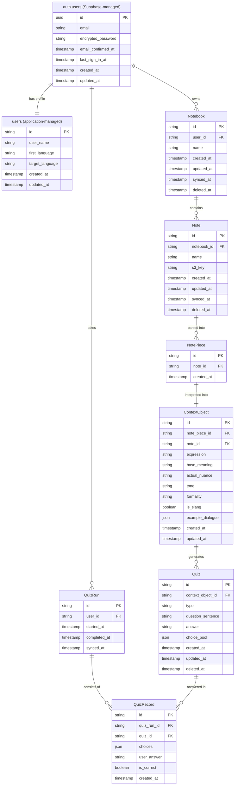

# Database Design

For architecture details, see [system_architecture.md](system_architecture.md).

---

## 1. Logical Design

### 1.1 Entity Extraction

This application's domain has the following entities:

| Entity | Role |
|--------|------|
| **User** | The learner using the app |
| **Notebook** | A container for notes — used to organize memos by theme or category |
| **Note** | An individual memo written by the user. Body content is stored in S3; DB holds metadata and reference |
| **Context Object** | The interpreted learning unit derived from a note — expression, meaning, nuance, tone, etc. This is the core of the app |
| **Quiz** | A generated question based on a context object. Multiple quiz types can be generated from one context object |
| **Quiz Run** | A single practice session (10 questions) |
| **Quiz Record** | A single answer within a quiz run — links a quiz to the user's response |

### 1.2 Aggregates

An aggregate is a cluster of entities that are treated as a single unit for data changes. Each aggregate has a root entity — the only entry point for creating, modifying, or deleting the entities within it.

| Aggregate Root | Members | Reason |
|---------------|---------|--------|
| **Note** | NotePiece | NotePiece has no meaning without its Note. Created and deleted only through Note operations |
| **ContextObject** | Quiz | A Quiz is generated from a ContextObject and has no independent existence |
| **QuizRun** | QuizRecord | A QuizRecord belongs to exactly one QuizRun and cannot exist independently |
| **Notebook** | — | Standalone aggregate |
| **User** | — | Standalone aggregate |

These aggregate boundaries are reflected in the application's transaction boundaries — for example, Note and its NotePieces are always written atomically in `SyncNotesUseCase`, and QuizRun and its QuizRecords are saved together in `SyncQuizRunsUseCase`.

---

### 1.3 Entity Definitions (Attributes)

**User**

Authentication (email, password) is managed by Supabase Auth in `auth.users`. Application-specific attributes are stored in `users`, linked to `auth.users.id`.

When Supabase Auth creates a record in `auth.users` (on register), a PostgreSQL trigger automatically creates a corresponding row in `users`. The application then fills in `user_name`, `first_language`, `target_language` via the repository layer.

The trigger and all table definitions are managed as SQL migration files via Supabase CLI (`supabase db push`) — no manual dashboard configuration needed.

`auth.users` (Supabase-managed, shown for reference):

| Attribute | Notes |
|-----------|-------|
| `id` | PK (UUID). Referenced by all other tables as `user_id` |
| `email` | Managed by Supabase Auth |
| `password_hash` | Managed by Supabase Auth |
| `created_at` | Managed by Supabase Auth |

**users** (application-managed):

| Attribute | Notes |
|-----------|-------|
| `id` | PK. FK → `auth.users.id` |
| `user_name` | |
| `first_language` | |
| `target_language` | |
| `created_at` | |
| `updated_at` | |

**Notebook**

| Attribute | Notes |
|-----------|-------|
| `id` | PK |
| `user_id` | FK → User |
| `name` | |
| `created_at` | |
| `updated_at` | |
| `synced_at` | |
| `deleted_at` | NULL when active; set to deletion timestamp for soft delete (tombstone sync) |

**Note**

| Attribute | Notes |
|-----------|-------|
| `id` | PK |
| `notebook_id` | FK → Notebook |
| `name` | The title of the note, as provided by the client |
| `s3_key` | Reference to the parsed note content stored in S3 |
| `created_at` | |
| `updated_at` | |
| `synced_at` | |
| `deleted_at` | NULL when active; set to deletion timestamp for soft delete (tombstone sync) |

**Note Piece**

| Attribute | Notes |
|-----------|-------|
| `id` | PK |
| `note_id` | FK → Note |
| `created_at` | |

> **Design decision — expression and annotation not stored in DB:** The parsed content of each note piece (`expression`, `annotation`) is stored in the S3 JSON file alongside the note's other pieces. The DB holds only the ID for linking purposes. The check "which note pieces already have a context object" is done by querying `context_objects.note_piece_id` — no content needed in the DB for that.

> **Design decision — no `order` column:** Order is implicit in the position of each piece within the S3 JSON array. There is no need to query pieces by order in the DB.

**Context Object**

| Attribute | Notes |
|-----------|-------|
| `id` | PK |
| `note_piece_id` | FK → NotePiece. UNIQUE — one context object per note piece (1:1). Used for diff detection: if a note piece no longer exists, its context object is deleted |
| `note_id` | FK → Note |
| `expression` | The target language phrase or sentence fragment |
| `base_meaning` | Direct translation / dictionary meaning |
| `actual_nuance` | What it really means in context |
| `tone` | e.g. rough, blunt, gentle, playful. Distinct from formality — tone describes *how* it feels, formality describes *where* it's appropriate |
| `formality` | One of: `casual`, `neutral`, `formal`. Casual = friends/daily, neutral = unmarked, formal = business/official. Originally had "informal" and "casual" as separate values but merged them — the distinction is too subtle to be useful for learners |
| `is_slang` | Boolean |
| `example_dialogue` | JSON array. e.g. `[{"speaker":"A","text":"..."},{"speaker":"B","text":"..."}]` |
| `created_at` | |
| `updated_at` | |

> **Design decision — no `appropriateness` attribute:** This was considered but removed as redundant. Appropriateness can be inferred from the combination of `formality`, `is_slang`, and `actual_nuance`.

**Quiz**

| Attribute | Notes |
|-----------|-------|
| `id` | PK |
| `context_object_id` | FK → Context Object |
| `type` | Quiz format. Defined as an enum in application code, not a separate entity — quiz types are fixed values that don't grow as user data. Values: `choose_context`, `choose_pronunciation`, `fill_metadata` |
| `question_sentence` | |
| `answer` | The correct answer. Must be one of the values in `choice_pool` |
| `choice_pool` | JSON array of 10 strings. The full pool of candidate choices including the correct answer |
| `created_at` | |
| `updated_at` | |
| `deleted_at` | NULL when active; set to deletion timestamp for soft delete. Client can request deletion via `deleted_quiz_ids` in `/sync/quizzes` |

**Quiz Run**

| Attribute | Notes |
|-----------|-------|
| `id` | PK |
| `user_id` | FK → User |
| `started_at` | |
| `completed_at` | NULL if user quit mid-session |
| `synced_at` | |

> **Design decision — no result summary entity:** Quiz run results (score, wrong/right breakdown) are computed by aggregating Quiz Records. No separate result entity is needed.

**Quiz Record**

| Attribute | Notes |
|-----------|-------|
| `id` | PK |
| `quiz_run_id` | FK → Quiz Run |
| `quiz_id` | FK → Quiz |
| `choices` | JSON array of strings. The subset of `choice_pool` presented to the user |
| `user_answer` | The answer the user selected |
| `is_correct` | Boolean |
| `created_at` | |

> **Design decision — records synced after completion:** Quiz records are created locally on the client during a run and synced to the server only after the run is complete (or at sync time). All records arrive with `user_answer` and `is_correct` already filled. The DB columns allow NULL to avoid a NOT NULL constraint on the cloud side, but in practice records always have values when synced.

### 1.4 Normalization

**First Normal Form (1NF)**

All attributes must hold a single atomic value. Three attributes violated this:

| Attribute | Issue | Resolution |
|-----------|-------|------------|
| `example_dialogue` | Structured multi-value data (speaker + text pairs) | Stored as JSON array |
| `appropriateness` | Multiple appropriate/inappropriate situations | Removed entirely as redundant (see design decision above) |

> **When to use JSON vs separate table:** If the data is used for search, filtering, or joins → normalize into a separate table. If it is only stored and displayed → JSON is a practical and widely accepted choice.

**Second Normal Form (2NF)**

Requires no partial dependency on a composite primary key. All tables use a single `id` as primary key, so 2NF is automatically satisfied.

**Third Normal Form (3NF)**

Requires no transitive dependency (non-key attribute depending on another non-key attribute). Reviewed all tables — no transitive dependencies found. 3NF is satisfied.

### 1.5 ER Diagram



### Relationships Summary

| Relationship | Cardinality | Description |
|-------------|-------------|-------------|
| User → Notebook | 1:N | A user owns multiple notebooks |
| Notebook → Note | 1:N | A notebook contains multiple notes |
| Note → Note Piece | 1:N | One note is parsed into multiple pieces, each representing a single expression + annotation |
| Note Piece → Context Object | 1:1 | Each note piece produces exactly one context object (AI interprets the expression into nuance, tone, formality, etc.) |
| Context Object → Quiz | 1:N | One context object generates multiple quiz formats (recall, choose nuance, etc.) |
| User → Quiz Run | 1:N | A user takes multiple quiz sessions |
| Quiz Run → Quiz Record | 1:N | One session consists of multiple answers (up to 10) |
| Quiz → Quiz Record | 1:N | One quiz can be answered multiple times across different runs |

---

## 2. Physical Design

### 2.1 DBMS Selection

| Layer | DBMS | Role |
|-------|------|------|
| **Cloud (server)** | Supabase PostgreSQL | Source of truth. All tables |
| **Client** | SQLite | Local cache for offline access and fast reads. Syncs with Supabase |

Supabase is a managed PostgreSQL service. The `public` schema holds application tables (`notebooks`, `notes`, etc.). The `auth` schema is managed by Supabase and holds user credentials (`auth.users`).

### 2.2 Naming Conventions

| Rule | Convention | Example |
|------|-----------|---------|
| Table names | **plural, snake_case, no prefix** | `users`, `context_objects`, `quiz_records` |
| Column names | **singular, snake_case** | `user_id`, `created_at`, `is_correct` |

Full table name mapping:

| Logical Entity | Schema | Table Name |
|---------------|--------|------------|
| User (auth) | `auth` | `auth.users` (Supabase-managed) |
| User (profile) | `public` | `users` |
| Notebook | `public` | `notebooks` |
| Note | `public` | `notes` |
| Context Object | `public` | `context_objects` |
| Quiz | `public` | `quizzes` |
| Quiz Run | `public` | `quiz_runs` |
| Quiz Record | `public` | `quiz_records` |

### 2.3 Column Types

PostgreSQL and SQLite use different type systems. The application code (TypeScript) is shared; the repository/DAO layer absorbs the differences.

**Type mapping rules:**

| Concept | PostgreSQL | SQLite | App (TypeScript) |
|---------|-----------|--------|-----------------|
| ID / FK | `UUID` | `TEXT` | `string` |
| Short string (bounded) | `VARCHAR(N)` | `TEXT` | `string` |
| Long string (unbounded) | `TEXT` | `TEXT` | `string` |
| Boolean | `BOOLEAN` | `INTEGER` (0/1) | `boolean` |
| JSON | `JSONB` | `TEXT` | `object` (via JSON.parse) |
| Timestamp | `TIMESTAMPTZ` | `TEXT` (ISO 8601) | `Date` |

> **Why not unify types across both DBs?** Each DB has strengths worth preserving. PostgreSQL's `TIMESTAMPTZ` enables efficient date range queries (`WHERE created_at > NOW() - INTERVAL '7 days'`). PostgreSQL's `JSONB` allows indexing JSON fields if needed later. Unifying to TEXT everywhere would sacrifice these capabilities. The repository layer handles conversion, and the TypeScript types remain the same regardless of which DB is used.

**Per-table column definitions (PostgreSQL types shown; see mapping above for SQLite equivalents):**

**auth.users** (Supabase-managed — shown for reference only, not created by application)

| Column | Type | Notes |
|--------|------|-------|
| `id` | `UUID` | PK |
| `email` | `TEXT` | NOT NULL, UNIQUE |
| `encrypted_password` | `TEXT` | |
| `email_confirmed_at` | `TIMESTAMPTZ` | NULL until email verified |
| `last_sign_in_at` | `TIMESTAMPTZ` | |
| `created_at` | `TIMESTAMPTZ` | |
| `updated_at` | `TIMESTAMPTZ` | |

**users**

| Column | Type | Notes |
|--------|------|-------|
| `id` | `UUID` | PK. FK → `auth.users.id`. ON DELETE CASCADE |
| `user_name` | `VARCHAR(100)` | NOT NULL |
| `first_language` | `VARCHAR(10)` | NOT NULL. Language code (e.g. "ja", "en") |
| `target_language` | `VARCHAR(10)` | NOT NULL. Language code |
| `created_at` | `TIMESTAMPTZ` | NOT NULL |
| `updated_at` | `TIMESTAMPTZ` | NOT NULL |

**notebooks**

| Column | Type | Notes |
|--------|------|-------|
| `id` | `UUID` | PK |
| `user_id` | `UUID` | NOT NULL. FK → `auth.users.id`. ON DELETE CASCADE |
| `name` | `VARCHAR(255)` | NOT NULL |
| `created_at` | `TIMESTAMPTZ` | NOT NULL |
| `updated_at` | `TIMESTAMPTZ` | NOT NULL |
| `synced_at` | `TIMESTAMPTZ` | NOT NULL |
| `deleted_at` | `TIMESTAMPTZ` | NULL when active. Set on soft delete |

**notes**

| Column | Type | Notes |
|--------|------|-------|
| `id` | `UUID` | PK |
| `notebook_id` | `UUID` | NOT NULL. FK → notebooks. ON DELETE CASCADE |
| `name` | `TEXT` | NOT NULL. Title of the note as provided by the client |
| `s3_key` | `TEXT` | NOT NULL. S3 path (length unpredictable) |
| `created_at` | `TIMESTAMPTZ` | NOT NULL |
| `updated_at` | `TIMESTAMPTZ` | NOT NULL |
| `synced_at` | `TIMESTAMPTZ` | NOT NULL |
| `deleted_at` | `TIMESTAMPTZ` | NULL when active. Set on soft delete |

**note_pieces**

| Column | Type | Notes |
|--------|------|-------|
| `id` | `UUID` | PK |
| `note_id` | `UUID` | NOT NULL. FK → notes. ON DELETE CASCADE |
| `created_at` | `TIMESTAMPTZ` | NOT NULL |

**context_objects**

| Column | Type | Notes |
|--------|------|-------|
| `id` | `UUID` | PK |
| `note_piece_id` | `UUID` | NOT NULL. UNIQUE. FK → note_pieces. ON DELETE CASCADE |
| `note_id` | `UUID` | NOT NULL. FK → notes. ON DELETE CASCADE |
| `expression` | `TEXT` | NOT NULL |
| `base_meaning` | `TEXT` | NOT NULL |
| `actual_nuance` | `TEXT` | NOT NULL |
| `tone` | `VARCHAR(50)` | NOT NULL |
| `formality` | `VARCHAR(50)` | NOT NULL. CHECK (formality IN ('casual', 'neutral', 'formal')) |
| `is_slang` | `BOOLEAN` | NOT NULL |
| `example_dialogue` | `JSONB` | NOT NULL. Display-only |
| `created_at` | `TIMESTAMPTZ` | NOT NULL |
| `updated_at` | `TIMESTAMPTZ` | NOT NULL |

**quizzes**

| Column | Type | Notes |
|--------|------|-------|
| `id` | `UUID` | PK |
| `context_object_id` | `UUID` | NOT NULL. FK → context_objects. ON DELETE CASCADE |
| `type` | `VARCHAR(50)` | NOT NULL. No CHECK — managed by app-side enum |
| `question_sentence` | `TEXT` | NOT NULL |
| `answer` | `TEXT` | NOT NULL |
| `choice_pool` | `JSONB` | NOT NULL. Array of 10 strings. Includes `answer` |
| `created_at` | `TIMESTAMPTZ` | NOT NULL |
| `updated_at` | `TIMESTAMPTZ` | NOT NULL |
| `deleted_at` | `TIMESTAMPTZ` | NULL when active. Set on soft delete |

**quiz_runs**

| Column | Type | Notes |
|--------|------|-------|
| `id` | `UUID` | PK |
| `user_id` | `UUID` | NOT NULL. FK → auth.users. ON DELETE CASCADE |
| `started_at` | `TIMESTAMPTZ` | NOT NULL |
| `completed_at` | `TIMESTAMPTZ` | NULL allowed — user may quit mid-session |
| `synced_at` | `TIMESTAMPTZ` | NOT NULL |

**quiz_records**

| Column | Type | Notes |
|--------|------|-------|
| `id` | `UUID` | PK |
| `quiz_run_id` | `UUID` | NOT NULL. FK → quiz_runs. ON DELETE CASCADE |
| `quiz_id` | `UUID` | NOT NULL. FK → quizzes. ON DELETE CASCADE |
| `choices` | `JSONB` | NOT NULL. Array of strings presented to the user |
| `user_answer` | `TEXT` | NULL allowed at DB level. Always populated when synced from client |
| `is_correct` | `BOOLEAN` | NULL allowed at DB level. Always populated when synced from client |
| `created_at` | `TIMESTAMPTZ` | NOT NULL |

### 2.4 Indexes

Primary keys automatically get an index. The following additional indexes are needed for foreign key lookups and search:

| Table | Column(s) | Index Name | Reason |
|-------|-----------|------------|--------|
| `notebooks` | `user_id` | `idx_notebooks_user_id` | List notebooks for a user |
| `notes` | `notebook_id` | `idx_notes_notebook_id` | List notes in a notebook |
| `note_pieces` | `note_id` | `idx_note_pieces_note_id` | List note pieces for a note |
| `context_objects` | `note_piece_id` | `idx_context_objects_note_piece_id` | Check if a note piece already has a context object (covered by UNIQUE constraint, but listed here for clarity) |
| `context_objects` | `note_id` | `idx_context_objects_note_id` | Delete all context objects for a note on re-sync |
| `quizzes` | `context_object_id` | `idx_quizzes_context_object_id` | List quizzes for a context object |
| `quiz_runs` | `user_id` | `idx_quiz_runs_user_id` | List quiz runs for a user |
| `quiz_records` | `quiz_run_id` | `idx_quiz_records_quiz_run_id` | List records in a quiz run |
| `quiz_records` | `quiz_id` | `idx_quiz_records_quiz_id` | Aggregate answer history for a quiz (accuracy rate) |

> **Why index every FK?** PostgreSQL does not automatically create indexes on foreign key columns (unlike primary keys). Without an index, any JOIN or WHERE clause on a FK column requires a full table scan — O(n). With a B-Tree index, lookup is O(log n).

### 2.5 Constraints

**NOT NULL:** All columns are NOT NULL except:
- `quiz_runs.completed_at` — NULL when user quits mid-session
- `quiz_records.user_answer` — NULL allowed at DB level (always populated when synced)
- `quiz_records.is_correct` — NULL allowed at DB level (always populated when synced)
- `notebooks.deleted_at` — NULL when active
- `notes.deleted_at` — NULL when active
- `quizzes.deleted_at` — NULL when active

**UNIQUE:**

`auth.users.email` is managed by Supabase.

| Table | Column | Reason |
|-------|--------|--------|
| `context_objects` | `note_piece_id` | Enforces the 1:1 relationship between note piece and context object |

**Foreign keys and ON DELETE:**

| FK | References | ON DELETE | Reason |
|----|-----------|-----------|--------|
| `users.id` | `auth.users.id` | CASCADE | User deleted → profile deleted |
| `notebooks.user_id` | `auth.users.id` | CASCADE | User deleted → all notebooks deleted |
| `notes.notebook_id` | `notebooks.id` | CASCADE | Notebook deleted → all notes deleted |
| `context_objects.note_id` | `notes.id` | CASCADE | Note deleted → all context objects deleted |
| `quizzes.context_object_id` | `context_objects.id` | CASCADE | Context object deleted → all quizzes deleted |
| `quiz_runs.user_id` | `auth.users.id` | CASCADE | User deleted → all quiz runs deleted |
| `quiz_records.quiz_run_id` | `quiz_runs.id` | CASCADE | Quiz run deleted → all records deleted |
| `quiz_records.quiz_id` | `quizzes.id` | CASCADE | Quiz deleted → all answer records deleted |

All FKs use CASCADE because the data ownership chain is a single path (User → ... → QuizRecord). If a parent is deleted, its children have no meaning without it.

**CHECK:**

| Table | Column | Constraint | Reason |
|-------|--------|-----------|--------|
| `context_objects` | `formality` | `CHECK (formality IN ('casual', 'neutral', 'formal'))` | Fixed linguistic categories that will not change |

`quizzes.type` intentionally has **no CHECK constraint** — quiz types are application logic that may grow with new features. Validated by app-side enum only.

---

## 3. Storage Design

### S3 (Parsed Note Content)

Note content is stored in S3 as a JSON file, not in the database. The database holds an `s3_key` reference on the Note entity.

The client sends already-parsed JSON content — the server stores it directly without any parsing step. The file is a flat array of note pieces (expression + annotation) in order.

| Concern | Decision |
|---------|----------|
| **Why S3?** | Note content is blob-like and unbounded in size. S3 is better suited for blob storage than a relational DB |
| **Why JSON, not raw text?** | The client sends pre-parsed JSON. Storing it directly means the server never needs to parse content — it just stores and retrieves |
| **Why `s3_key` in DB?** | Decouples the application from S3 path conventions. If the S3 path structure changes, only the `s3_key` values need updating — no application code changes required |
| **Why not store `expression`/`annotation` in DB?** | DB holds only IDs for linking. Content lives in S3 alongside the other pieces of the same note, keeping the content unit cohesive |

S3 path convention (for reference, not enforced by application code):

```
s3://{bucket}/{user_id}/{notebook_id}/{note_id}.json
```

S3 file format (flat array — no wrapping object):

```json
[
  {
    "note_piece_id": "uuid",
    "expression": "가성빈대",
    "annotation": "コスパいいじゃん、少し驚きを含む"
  },
  {
    "note_piece_id": "uuid",
    "expression": "우산 잃어버렸다",
    "annotation": "傘忘れた"
  }
]
```

---

For concepts and insights learned during the DB design process, see [.learnings.md](../.learnings.md).
