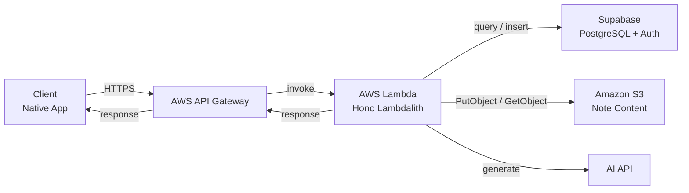

# Context-First Language Review App — System Architecture

---

## 1. Data Model

The learning unit is not a word or a flashcard. It is a **context object**.

### Three storage layers

| Layer | Content | Storage |
|-------|---------|---------|
| **A. Parsed source (Note)** | The client's note content (pre-parsed JSON array of note pieces) | S3 (referenced via `s3_key` in DB) |
| **B. Interpreted source (Context Object)** | Structured understanding: expression, meaning, actual nuance, tone, formality, slang flag, example dialogue | DB |
| **C. Generated artifacts (Quiz)** | The actual quizzes, generated from B | DB |

Quizzes are **saved locally** (not regenerated each time) for consistency, speed, cost savings, and offline access. Regeneration is possible when needed.

### What a context object includes
- Phrase / sentence fragment (`expression`)
- Base meaning (`base_meaning`)
- Actual nuance (`actual_nuance`)
- Tone and formality (`tone`, `formality`)
- Slang flag (`is_slang`)
- Example dialogue (`example_dialogue`)

Fields above match the canonical schema in `docs/db_design.md` and `docs/api_design.md`.

---

## 2. Architecture

### Stable architecture

These aspects are long-term architectural decisions:

**Client:**
- Local storage (SQLite) for quizzes, Quiz Run history, scheduling
- Adaptive review logic (prioritize weak/missed items)
- Offline-capable review

**Server (Proxy):**
- Thin proxy between client and external APIs (AI API as proxy; ADR-004).
- Send notes to AI API for interpretation and quiz generation
- Manage API keys, prompt templates, rate limiting
- Authenticate requests via JWT (verified by calling Supabase Auth API using `@supabase/supabase-js` — enables token revocation)

### System overview

```
                    ┌──────────────────┐     ┌────────────┐
                    │                  │────▶│  AI API    │
                    │  API Gateway +   │◀────│            │
                    │  Lambda (Hono)   │     └────────────┘
                    │  Lambdalith      │
                    │                  │────▶┌──────────────────────┐
                    │                  │◀────│ Supabase             │
                    └────────┬─────────┘     │ ├─ PostgreSQL DB     │
                             │ ▲             │ │  (source of truth) │
                             │ │             │ └─ Auth              │
                             │ │             │    (JWT issuance)    │
                             ▼ │             └──────────────────────┘
                    ┌──────────────────┐
                    │  Client          │     ┌────────────┐
                    │  (Native App)    │     │ Amazon S3  │
                    │  ┌────────────┐  │     │ (note      │
                    │  │ SQLite     │  │     │  content)  │
                    │  │ (local     │  │     └────────────┘
                    │  │  cache)    │  │
                    │  └────────────┘  │
                    └──────────────────┘
```

Cloud DB is not used in MVP. In production, **Supabase PostgreSQL (managed PostgreSQL; underlying infra abstracted)** is introduced as the cloud database and becomes the **source of truth**. The client syncs with Supabase via the API Server (not directly). Local SQLite becomes a cache for offline access and fast reads. Supabase Auth handles user authentication and JWT issuance; JWT verification is delegated to Supabase Auth API via `@supabase/supabase-js`, enabling token revocation on logout or suspicious activity.

### Client platforms

- **MVP**: Web SPA (browser)
- **Production**: Native app (iOS/Android)

### Infrastructure overview (Production)



### Local-first by default

The default experience works without internet:
- Browse and review quizzes
- See stored metadata
- Track correct / incorrect
- Repeat previously generated content

Internet is used when: (1) generating quizzes from saved memos, and (2) the user explicitly requests AI-assisted learning.

### Sync flow

All user data syncs through the `/sync/*` POST endpoints. There are no standalone GET endpoints for user data.

| Request | Trigger |
|---------|---------|
| `POST /sync/notebooks` | App startup and before tapping generate — upload client notebooks/notes, receive server state |
| `POST /sync/quizzes` | After `POST /sync/notebooks` when user taps generate — receive context objects and quizzes |
| `POST /sync/quiz-runs` | App startup and after quiz run completes — upload client quiz runs, receive server state |

These requests are **best-effort**: if the network is unavailable or the request fails, the app silently continues without interruption. The user should never be blocked by a failed background sync. Local SQLite remains the source of truth for the current session regardless of sync outcome.

The client always writes locally first, then attempts to sync.

### Storage

The app needs to store:
- **Amazon S3**: Parsed note content (flat JSON array of note pieces per note)
- **Supabase PostgreSQL**: Notebooks, notes (metadata + S3 reference), context objects, quizzes, quiz runs, quiz records
- **Supabase Auth**: User credentials (email, password hash)
- **Client SQLite**: Local cache for offline access and fast reads

For full data model details, see [db_design.md](db_design.md).

---

## 3. Backend Architecture

### Lambdalith pattern

The entire API server is a single Hono application deployed as one AWS Lambda function, fronted by AWS API Gateway. All routes are handled by this single function — there are no per-route Lambda functions.

This keeps deployment simple and avoids cold-start fragmentation across many functions.

### Domain-Driven Design with CQS-lite

The codebase follows DDD with a lightweight Command-Query Separation (CQS-lite) approach:

- **Read interfaces (QueryService)**: Separate interfaces for read-only queries. Implementations live in `src/infrastructure/` and are injected at the route layer.
- **Write interfaces (Repository)**: Separate interfaces for writes/mutations. Implementations also live in `src/infrastructure/`.
- No combined repository unions — read and write concerns are separated at the interface level.

### Layer structure

```
src/routes/          ← Hono route handlers (composition root; wires dependencies)
src/usecases/        ← Application usecases (pure business logic)
src/usecases/queries/← Read-only query service interfaces (CQS-lite)
src/domain/          ← Domain types, repository interfaces, domain logic
src/infrastructure/  ← Repository and QueryService implementations (Supabase, S3)
src/schemas/         ← Zod validation schemas
```

Data flows inward: routes → usecases → domain. Infrastructure implements domain interfaces and is injected at the route layer (composition root). Domain and usecase layers have no dependency on infrastructure.

### Technology choices

| Concern | Technology |
|---------|-----------|
| HTTP framework | Hono |
| Runtime | Bun (local dev) / AWS Lambda (production) |
| Database | Supabase PostgreSQL |
| Authentication | Supabase Auth (JWT issued by Supabase; verified via `@supabase/supabase-js`) |
| Note content storage | Amazon S3 |
| Validation | Zod |
| Language | TypeScript |

---

## 4. Core Value vs Supporting Infrastructure

### Core value
**Turning personal language experience into context-rich active recall practice:**
- Interpreting messy notes
- Preserving nuance
- Generating good quizzes
- Designing learning prompts aligned with context-first philosophy

### Possible core extension
The AI teaching layer — if prompts are carefully designed and explanations embody the app's philosophy, this becomes a real differentiator.

### Supporting infrastructure
- Quiz History & statistics
- Adaptive scheduling (spaced repetition / wrong-count repetition / custom priority)
- Local database management
- Sync (if added later)

### Progression model
Not level-based (beginner/intermediate/advanced). Instead, **experience-first progression** based on:
- Recently captured expressions
- Frequently missed items
- Items the user still cannot actively recall
- Items tied to situations the user actually encounters
